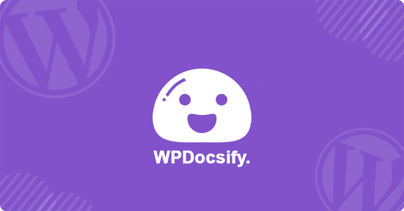

<p align="center">
    
</p>

<div align="center">
<h2>WPDocsify.</h2>
<h3>A magical documentation library for Wordpress.</h3>
</div>

# WPDocsify
WPDocsify is a wordpress implementation of [Docsify](https://docsify.js.org/) designed to simplfy documenting your wordpress projects or plugins  

# Features

- Simple and lightweight
- No statically built html files
- Multiple Documentation Librarys
- Customizable
- User restrictions
- Prism code highlighting support
- Plugin support
- Vue@2 | Vue@3 Inline support
- Works Natively
- Easy to setup

# Links

- [Docsify Documentation](https://docsify.js.org)
- [Awesome docsify](https://github.com/docsifyjs/awesome-docsify)
- [Docsify Community chat](https://discord.gg/3NwKFyR)

# Quick start
When you have installed the plugin it should appear in the Wordpress Admin sidebar. By default it will display the plugins documentation page.  

To get started navigate to your theme directory and create a new folder called `/documentation/`

**Note: we can change this base directory naming later on in [Overides](#overides).**

All the Documentation is written in [Markdown](https://www.markdownguide.org/) As so all the documentation will end in the `.md` filetype  
If you are not familar with the markdown you can copy the following documentation from this plugins assets to your newly created folder to get started.


# Documentation Sub Pages
Sub Pages enables you to stack multiple Documentation librarys in the backend. This can be useful if there is multiple Custom plugins or functionality you wish to write documentation on without filling up one page.

## Creating a sub page
Creating a page is simple, We are calling the WPDocsify Class within a php file.
For this example we will use the functions.php file located within your base theme folder.

```php
/* functions.php */

/* Is not required rename the namespace using MBC\inc before the class is fine */
use MBC\inc as PLUGINS;

/* Single Page Register */
PLUGINS\WPDocsify::register(
    array(
        /* Page Title */
        'title'=>'Feature',
        /* Page Label */
        'label'=>'Feature Documentation',
        /* Page Slug ( No spaces ) */
        'slug'=>'feature',
        /* Documentation Folder */
        'location'=> get_template_directory_uri().'/feature_docs/',
        /* Documentation Config ( more can be found Customizations/Configurations ) */
        'config'=> array(
            'maxLevel'=> 4, 
            'subMaxLevel'=> 2,
            'loadSidebar'=> "_sidebar.md",
            'homepage'=> "quickstart.md",
        ),
    )
);


/* Registering Multiple Pages */
PLUGINS\WPDocsify::register(
    array(
        /* Arrays Within a single Array */
        array(
            'title'=>'Feature',
            'label'=>'Feature Documentation',
            'slug'=>'feature',
            'location'=> get_template_directory_uri().'/feature_docs/',
            'config'=> array(
                'maxLevel'=> 4, 
                'subMaxLevel'=> 2,
                'loadSidebar'=> "_sidebar.md",
                'homepage'=> "quickstart.md",
            ),
        ),
        array(
            'title'=>'Custom',
            'label'=>'Custom Documentation',
            'slug'=>'custom',
            'location'=> get_template_directory_uri().'/custom_docs/',
            'config'=> array(
                'maxLevel'=> 4, 
                'subMaxLevel'=> 2,
                'loadSidebar'=> "_sidebar.md",
                'homepage'=> "quickstart.md",
            ),
        )
    )
);
```

## Page Restrictions
If you wish to restrict certain documentation behind specific user `Roles`, `ID` or `Capabilities` it is possible to do so by extended the pages configuration  

```php
/* functions.php */

/* Is not required rename the namespace using MBC\inc before the class is fine */
use MBC\inc as PLUGINS;

/* Restricted Page Register */
PLUGINS\WPDocsify::register(
    array(
        'title'=>'Feature',
        'label'=>'Feature Documentation',
        'slug'=>'feature',
        'location'=> get_template_directory_uri().'/feature_docs/',
        /* Restricted ( Array. Roles || Capabilities || ID ) */
        'restricted'=> array('administrator','manage_woocommerce',1),
        /* Restriction Operator ( String. and || or ) */
        'restrict_operator'=> 'and',
        'config'=> array(
            'maxLevel'=> 4, 
            'subMaxLevel'=> 2,
            'loadSidebar'=> "_sidebar.md",
            'homepage'=> "quickstart.md",
        ),
    )
);
/* Note this will return a page only if the user is an adiminstrator & has the capability of manage_woocommerce & the user id is 1 */
```

# Prism Highlighting
[Prism](https://prismjs.com/) is a code highlighter that works with Markdown it is an estiental part of Docsify to highlight your code.  
By Default Docsify has Prismjs support but not all languages are installed.

## Using Prism
To highlight your code using prism we need to wrap your code around 3 backticks followed by the file type and another 3 backticks

```
```php  
    function test(){
        echo "hello world";
    }
```⠀
```
## Extending Prism
If the language you looking to use with prism is not highlighting you can extend prism to include the langauge if availble.  
A full list of languages can be found here [Prism Langauges](https://prismjs.com/#supported-languages) or [Prism CDN](https://cdnjs.com/libraries/prism)  

```php
/* functions.php */

/* Is not required rename the namespace using MBC\inc before the class is fine */
use MBC\inc as PLUGINS;

/* extend prism languages */
/* full list of languages and versions here https://cdnjs.com/libraries/prism */
PLUGINS\WPDocsify::prism(
    array(
        'version'=> "1.28.0", //not required unless you wish for a specific version
        "languages"=> array(
            "php",
            "csharp",
            "graphql"
        ),
        "stylesheet"=> get_stylesheet_uri() . "/assets/prism/style.css" // not required can use to extend the stylesheet
    )
);
```  

# Overides
There are multiple overides to the base implementation of WPDocsify most of wich will configure the base menu structure

## Admin Menu
To Change the naming and menu of WPDocsify can be done with the following class function

```php
/* functions.php */

/* Is not required rename the namespace using MBC\inc before the class is fine */
use MBC\inc as PLUGINS;

PLUGINS\WPDocsify::adminRegister(array(
    "domain"=>"MyDocs", //Domain Namespace
    "name"=>"documenttester", //Menu Name
    "slug"=>"testdocs", //Menu Slug
    "icon"=> __DIR__ .'/assets/icons/alarm.svg', //Not required Menu icon ( Direct Path ) ( Can be Dashicons string )
    "position"=> 98, //Not Required Menu Position
    "location"=> get_stylesheet_directory_uri().'/documentation/', //Not Required Default folder
    "restricted"=>array('administrator','bbp_keymaster',1), //Not required Restrictions
    "restrict_operator"=> 'and', //Not required Restriction Operator
    "config"=> array( //Not Required Docsify config
        'maxLevel'=> 4,
        'subMaxLevel'=> 2,
        'loadSidebar'=> "_sidebar.md",
        'homepage'=> "quickstart.md",
    )
));
/* Note this will return the admin page only if the user is an adiminstrator & has the 
capability of manage_woocommerce & the user id is 1 */
```
if you are fine with the default Admin page you can still edit some settings without remapping the menu
```php
/* Base Docsify Config */
PLUGINS\WPDocsify::config(array(
    "maxLevel"=> 4,
    "subMaxLevel"=> 2,
    "loadSidebar"=> "_sidebar.md",
    "homepage"=> "_coverpage.md",
));

/* Base Documentation Location */
PLUGINS\WPDocsify::base(get_stylesheet_directory_uri().'/documentation/');
```


## Documentation Sub Pages
To Extend the documentation menu to have multiple sub page documentation librarys you can use the following

```php
/* functions.php */

/* Is not required rename the namespace using MBC\inc before the class is fine */
use MBC\inc as PLUGINS;

PLUGINS\WPDocsify::register(
    array(
        array(
            'title'=>'Feature',
            'label'=>'Feature Documentation',
            'slug'=>'feature',
            'location'=> get_template_directory_uri().'/feature_docs/',
            /* Restricted ( Array. Roles || Capabilities || ID ) */
            'restricted'=> array('administrator','manage_woocommerce',1),
            /* Restriction Operator ( String. and || or ) */
            'restrict_operator'=> 'and',
            'config'=> array(
                'maxLevel'=> 4, 
                'subMaxLevel'=> 2,
                'loadSidebar'=> "_sidebar.md",
                'homepage'=> "quickstart.md",
            ),
        )
    )
);
/* Note this will return a page only if the user is an adiminstrator & has the capability of manage_woocommerce & the user id is 1 */

```

## Extend Stylesheet
To extend the style of Docisfy you can use the following class function  

```php
/* functions.php */

/* Is not required rename the namespace using MBC\inc before the class is fine */
use MBC\inc as PLUGINS;

PLUGINS\WPDocsify::stylesheet(
    get_template_directory_uri().'/assets/css/WPDocsify.css',
    true //Not Require Replace default style if true append if false ( True or false )
);
```

## Extend Plugins
Docsify allows for multiple custom created and propritery plugins you can also make your own plugins using the [Docsify plugin lifecycle](https://docsify.js.org/#/write-a-plugin)  

```php
/* functions.php */

/* Is not required rename the namespace using MBC\inc before the class is fine */
use MBC\inc as PLUGINS;


PLUGINS\WPDocsify::plugins(
    array(
        '//cdn.jsdelivr.net/npm/docsify/lib/plugins/ga.min.js', //Google Analytics
        '//cdn.jsdelivr.net/npm/docsify/lib/plugins/zoom-image.min.js' //Zoom image
    )
);
```

## Vue.js
By Default Vue3 Production is turned on however you can choose to disable this or change it to development or vue2 more information on Vue implementation [Vue Compatibility](https://docsify.js.org/#/vue)
```php
/* functions.php */

/* Is not required rename the namespace using MBC\inc before the class is fine */
use MBC\inc as PLUGINS;

/* Vue 3 Production ( Default ) */
PLUGINS\WPDocsify::vue('vue@3','production');
/* Vue 3 Development */
PLUGINS\WPDocsify::vue('vue@3','development');

/* Vue 2 Production */
PLUGINS\WPDocsify::vue('vue@2','production');
/* Vue 2 Development */
PLUGINS\WPDocsify::vue('vue@2','development');

/* Vue disabled */
PLUGINS\WPDocsify::vue(false);
```

## License

[MIT](LICENSE)

## Author

**Mitchell Chelin**

- Linkedin: [@mitchell-chelin](https://www.linkedin.com/in/mitchell-chelin/)
- Email: [Gmail](mitchell.b.chelin@gmail.com)